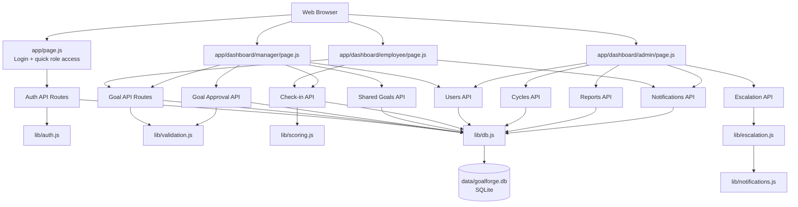
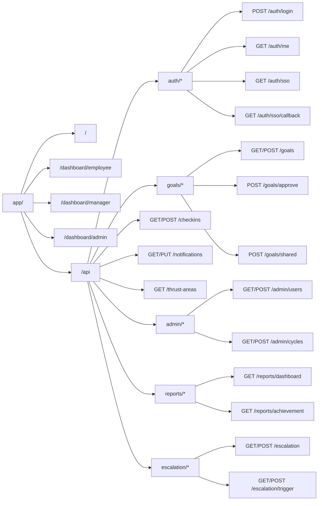
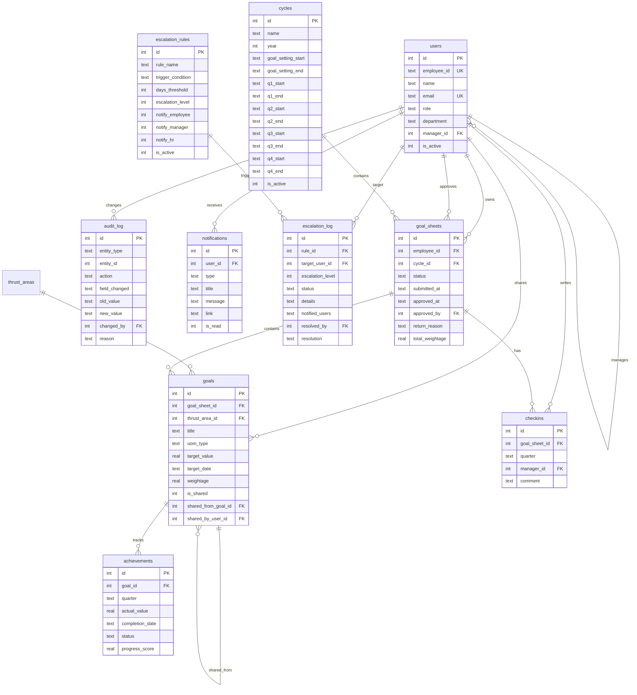
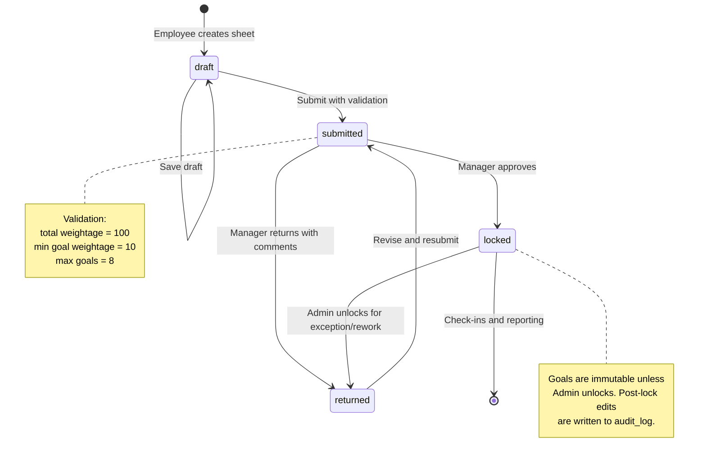
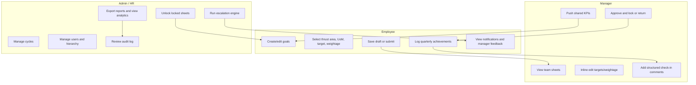
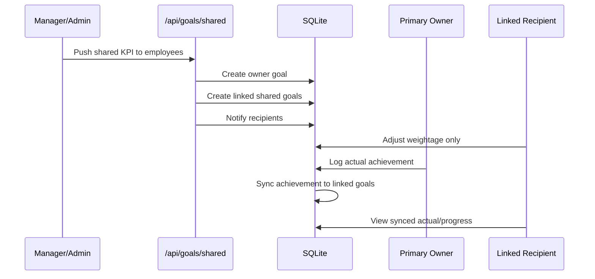
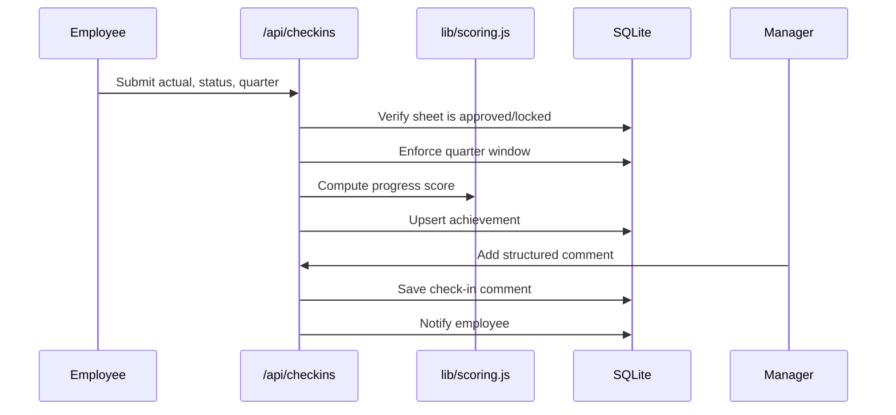
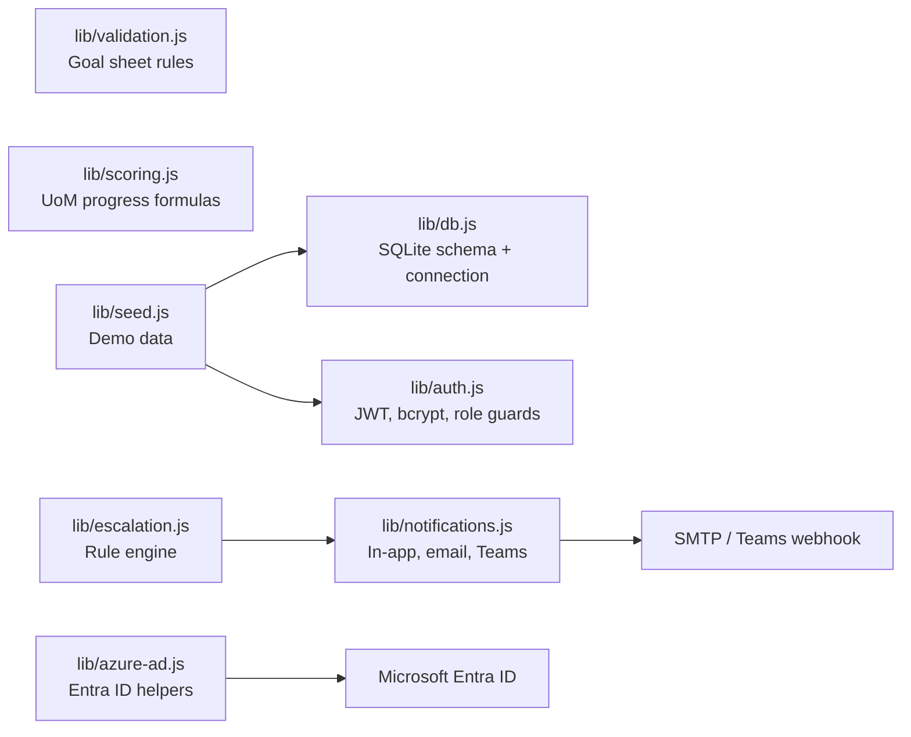
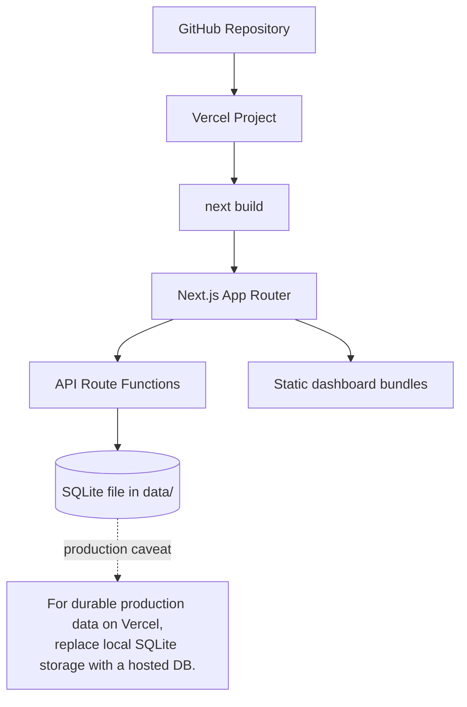

# GoalForge Codebase Graph

This document graphifies the GoalForge Next.js codebase: application surfaces, API routes, shared libraries, database relationships, and the core BRD workflows.

## System Architecture

## Route Map

## Database ERD

## Core Goal Lifecycle

## Role Workflows

## Shared KPI Flow

## Quarterly Check-in Flow

## Library Dependency Graph

## Feature-To-Code Matrix

| Requirement Area | Main Code |
|---|---|
| Login, JWT auth, RBAC | `app/api/auth/*`, `lib/auth.js`, `middleware.js` |
| Employee goal sheet creation | `app/dashboard/employee/page.js`, `app/api/goals/route.js` |
| Weightage and goal validation | `lib/validation.js`, `app/api/goals/route.js`, `app/api/goals/approve/route.js` |
| Manager approval and inline edits | `app/dashboard/manager/page.js`, `app/api/goals/approve/route.js` |
| Shared/cascaded goals | `app/api/goals/shared/route.js`, `app/api/checkins/route.js` |
| Quarterly achievements | `app/dashboard/employee/page.js`, `app/api/checkins/route.js`, `lib/scoring.js` |
| Manager check-in comments | `app/dashboard/manager/page.js`, `app/api/checkins/route.js` |
| Admin cycles/users/unlock | `app/dashboard/admin/page.js`, `app/api/admin/cycles/route.js`, `app/api/admin/users/route.js` |
| Reporting and CSV export | `app/api/reports/dashboard/route.js`, `app/api/reports/achievement/route.js` |
| Audit trail | `lib/db.js`, `app/api/goals/route.js`, `app/api/goals/approve/route.js`, `app/api/admin/users/route.js` |
| Escalation module | `lib/escalation.js`, `app/api/escalation/*` |
| Notifications, email, Teams | `lib/notifications.js`, `app/api/notifications/route.js` |
| Microsoft Entra ID SSO | `lib/azure-ad.js`, `app/api/auth/sso/*` |

## Deployment Shape

